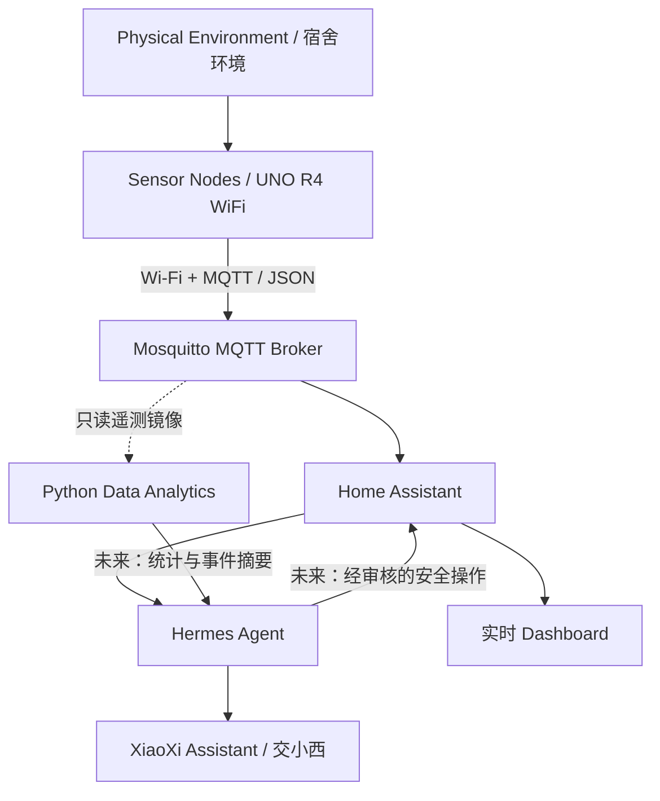

# XiaoXi DormSense

## 交小西宿舍智能体

*An Agentic Smart Dormitory System Based on Wireless Sensor Networks*

**Under Development · 本科课程六人小组项目**  
[English](README_EN.md) · [系统架构](docs/architecture.md) · [开发指南](docs/development.md) · [AI Agent 规范](AGENTS.md)

让宿舍的温度、湿度和光照“有迹可循”，也让环境信息变成可理解的建议。XiaoXi DormSense 希望把无线传感网络、智能感知、大数据分析与 AI Agent 结合，构建一个有校园温度、但不夸大能力的宿舍智能助手。

> 当前交付是**工程初始化骨架**：文档、协议、离线模拟器、配置样例与基础检查。真实采样、平台部署和 Agent 联调均未完成验收；本页不把计划写成已实现功能。

## 项目背景

大学生宿舍需要了解环境是否闷热、潮湿、过暗，以及一段时间内的变化趋势。我们从可解释、低成本的环境监测入手，而不是监控个人作息或设计自动控制危险电器的系统。

项目来自 **Xi'an Jiaotong University（西安交通大学）**仪器科学与技术、测控技术与仪器及智能感知背景的学生课程实践：

- **无线传感网络**：节点采样、Wi-Fi/MQTT 传输、掉线重连、多节点通信与网络性能实验。
- **大数据基础**：可追溯数据采集、清洗、缺失处理、时间序列、统计分析、异常检测与可视化。课程原型数据规模有限，不冒称已具备海量分布式处理能力。

## 项目目标

**核心 / MVP**

1. 使用已拥有的 Arduino UNO R4 WiFi 与至少一个经确认的真实传感器完成端到端演示。
2. 统一节点 ID、消息格式、时间和离线语义，接入 Mosquitto 与 Home Assistant。
3. 在可验证的只读边界下，通过 Hermes Agent 查询并解释当前环境状态。
4. 让六位成员能在清晰接口下并行开发，保留代码、测试与实验的可复现记录。

**后续扩展**

多传感器/多节点、可选 ESP32、历史数据分析、确定性异常检测、环境日报、安全的低压 LED 场景，以及适度角色化交互。InfluxDB、Grafana、Scikit-learn 不是 MVP 依赖；硬件按实际拥有情况决定，不预设全部购买。

## 主要功能与当前状态

| 能力 | 本次状态 |
| --- | --- |
| 多传感器环境感知（温湿度、光照等） | **Planned**；传感器型号与接线待核实，没有硬件驱动 |
| MQTT 无线数据传输 | v1 协议、Schema 和模拟发布入口已提供；真实无线链路 **Planned** |
| Home Assistant 实时监控 | 模拟节点实体/面板配置样例已提供；运行验收 **Planned** |
| 历史数据采集与分析 | 输入与目录约定已定义；程序、存储与图表 **Planned** |
| 智能异常检测 | 确定性阈值/窗口方法设计；实现与实验 **Planned** |
| Hermes Agent 自然语言交互 | 官方集成源码已核查、策略草案已提供；实例接入 **Planned** |
| 宿舍环境日报与安全场景控制 | **Planned**；当前无可用的日报接口或控制执行层 |
| 开发验证 | 离线模拟、协议测试、静态配置检查和轻量 CI 定义已提供；不等于实物验收 |

## 技术架构



主链为 **Arduino → MQTT → Home Assistant → Hermes Agent**；分析使用 Broker 的约定只读数据出口，避免重复管理或控制设备。实时监测和异常检测主要由确定性程序完成，**不把每条传感器数据发送给 LLM**。Agent 负责理解意图、调用工具、解释结果和组织反馈。

详细边界见[架构](docs/architecture.md)。Hermes 原生 `homeassistant` 工具集同时包含读写，不能当成天然只读；真正执行边界完成前，不给 Agent 真实 HA Token，见[核查与安全限制](hermes/README.md)。

## 技术栈

| 层级 | 技术 | 说明 |
| --- | --- | --- |
| 感知 | Arduino UNO R4 WiFi、C/C++ | 已拥有主板；传感器型号待确认 |
| 固件开发 | Arduino IDE 2.x + 官方板卡核心 | 初期低门槛；PlatformIO 经板卡工具链验证后再引入 |
| 通信 | Wi-Fi、MQTT 3.1.1、JSON | Mosquitto、v1 消息契约 |
| 平台 | Home Assistant | 实体、Dashboard、未来安全自动化 |
| Agent | [Hermes Agent](https://github.com/NousResearch/hermes-agent) | 独立安装；本仓库只放项目自定义内容 |
| 分析 | Python 3.11+、Pandas、NumPy、Matplotlib | 首期本地 JSONL 与离线分析；其他数据库/模型可选 |
| 部署 | Docker Compose、Linux/macOS | 本机隔离样例；LAN/TLS/ACL 待联调 |
| 协作 | GitHub Flow、Issues、Projects、PR、AI coding agents | 六人分工、人工审查、实验诚信 |

## 项目结构

```text
xiaoxi-dormsense/
├── README.md / README_EN.md / AGENTS.md / LICENSE
├── .github/              # Issue、PR 模板与轻量 CI
├── docs/                 # 架构、硬件、协议、开发、部署、实验与协作
├── schemas/              # MQTT 遥测 JSON Schema
├── firmware/             # UNO R4；ESP32 仅为可选规划
├── home-assistant/       # MQTT 实体与 Dashboard 样例
├── hermes/               # 官方集成核查、项目提示策略与 Skills 规划
├── analytics/            # 分析依赖、实现/Notebook 边界说明
├── simulator/            # 显式模拟数据，默认不联网
├── data/                 # 公开模拟样例；本地运行数据忽略
├── tests/                # 协议、离线模拟和静态集成配置测试
├── scripts/              # 仓库检查器
├── deploy/               # Mosquitto / 可选 HA 的 Compose
└── presentation/         # 课程展示计划与证据要求
```

## 快速开始

### 1. 获取仓库并准备开发环境

如果已经处于当前仓库，跳过 clone/cd。以下命令确有对应文件，不会安装 HA 或 Hermes：

```bash
git clone https://github.com/donald-trump86/xiaoxi-dormsense.git
cd xiaoxi-dormsense
python3 -m venv .venv
source .venv/bin/activate
python -m pip install -r requirements-dev.txt
```

### 2. 无硬件、无网络服务的冒烟检查

```bash
python simulator/mqtt_node.py --count 3
python -m unittest discover -s tests -p 'test_*.py' -v
python scripts/check_repository.py
```

模拟器只输出 JSONL，不默认联网；每条记录 `simulated=true`、`timestamp=null`。`node90` 专用于示例，不代表已有实体设备。可选 MQTT 发布需安装 `simulator/requirements.txt` 并按[模拟说明](simulator/README.md)配置，不是上述离线命令的隐含行为。

### 3. 按模块开始开发

- 固件先填[硬件确认表](docs/hardware.md)，不猜接线或型号。
- 平台按[部署指南](docs/deployment.md)手工创建密码文件及测试实例；默认只监听本机，真实 UNO 接入还需网络评审。
- Agent 先读[Hermes 核查](hermes/README.md)，确认版本与权限，而不是复制未经核实的 CLI/Skill 示例。
- 任何秘密只存本机忽略文件；`.env.example` 是占位模板，不含可用凭据。

当前依赖使用版本范围、容器使用初始标签；首次集成验收时记录并固定所测版本，不将本骨架视为已经锁定的生产部署。

## 六人团队协作

| 小组 | 成员占位 | 主要任务 |
| --- | --- | --- |
| 感知与通信组 | A、B | A：总体架构/MQTT/集成；B：真实采样/固件/边缘处理 |
| 平台与数据组 | C、D | C：HA/Mosquitto/部署；D：采集/清洗/分析/实验 |
| Agent 与应用组 | E、F | E：Hermes/工具边界；F：交互/自动化/测试/展示 |

姓名和 GitHub 用户名由本人后续填写。每人有独立技术交付与验收条件，见[团队分工](docs/team.md)。采用 GitHub Flow：`main` 稳定、功能分支、小 PR、同伴审查；不多人直接改 main。[开发流程](docs/development.md)说明 Issues/Projects 用法，尚未自动创建远程项目或保护规则。

AI 辅助开发遵守 [AGENTS.md](AGENTS.md) 和 [AI 使用规范](docs/ai-usage.md)：代码可理解、结果可复现、实验可验证、数据可追溯。

## 开发路线

1. **Phase 1 / MVP**：至少一个真实传感器完成 Arduino → MQTT → HA → Hermes 只读查询；留存真实链路证据。
2. **Phase 2**：多传感器/多节点（额外 ESP32 可选）、历史数据、清洗、图表、通信实验与确定性异常检测。
3. **Phase 3**：自然语言与历史查询、智能提醒、环境日报、适度角色化、系统测试和最终展示；控制需另行安全验收。

每阶段的退出条件见[路线图](docs/roadmap.md)，无线传感网络与大数据实验的方法/指标见[实验设计](docs/experiments.md)。当前没有真实实验数据或结果。

## 项目状态与待确认

**Under Development**。优先确认传感器实际型号、电气兼容、实验网络、部署主机、六人对应身份、课程期限和 Hermes 只读边界。实现细节与验收记录逐步通过 PR 落地；初始化验证范围见[初始化记录](docs/initialization.md)。

## 致谢、许可证与免责声明

感谢 Arduino、Eclipse Mosquitto、Home Assistant、NousResearch Hermes Agent 及 Python 科学计算生态。仓库原有 [MIT LICENSE](LICENSE) 保持不变；第三方依赖、素材和数据仍适用各自许可证。

“交小西”的校园文化灵感旨在让课程实践更有趣。**本项目是独立开发的学生课程项目，不代表西安交通大学或任何相关虚拟形象的官方项目，亦不表示获得官方授权或背书。** 未经确认授权不使用受保护的官方形象、校徽等素材。系统原型不承担消防、医疗或人身安全保障功能，不公开真实宿舍成员活动记录。
