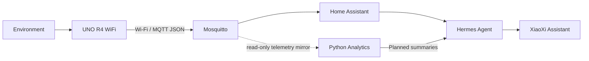

# XiaoXi DormSense

**交小西宿舍智能体**  
*An Agentic Smart Dormitory System Based on Wireless Sensor Networks*

**Under Development** · [中文文档](README.md)

A six-student undergraduate course project at Xi'an Jiaotong University, connecting instrumentation, intelligent sensing, Wireless Sensor Networks, and Big Data Fundamentals. We aim to turn dormitory environmental readings into understandable, privacy-conscious insights.

## Scope and status

The repository currently contains an engineering scaffold: documentation, MQTT v1 contract/Schema, explicitly synthetic samples, an offline-first simulator, configuration examples and offline checks. **Real sensor firmware, deployed services, analytics pipelines and a working Hermes integration are Planned, not delivered features.**

Only the Arduino UNO R4 WiFi and some sensors of unconfirmed models are known to be available. Additional ESP32 nodes are optional. No sensor model, wiring or measurement result is invented.

## Architecture



Home Assistant owns device state and future control. Analytics consumes the agreed read-only MQTT feed. Deterministic code handles monitoring and anomaly detection; sensor samples are **not** sent individually to an LLM. Hermes interprets intent and explains tool results.

The upstream HA toolset includes both read and write tools. Its limited blocked-domain list is not a fine-grained safety boundary. Do not provide real HA credentials until a verified read-only execution boundary exists. See the [source-pinned Hermes review](hermes/README.md).

## Stack and layout

- C/C++ and Arduino IDE 2.x initially; PlatformIO only after board/toolchain verification.
- Wi-Fi, MQTT 3.1.1, JSON, Mosquitto and Home Assistant.
- Python 3.11+, Pandas, NumPy and Matplotlib; optional databases/dashboards later.
- Independent upstream Hermes installation; no upstream source vendored here.
- Docker Compose on Linux/macOS; GitHub Flow and human-reviewed PRs.

Modules: `firmware/`, `home-assistant/`, `hermes/`, `analytics/`, `simulator/`. Contracts and supporting material: `docs/`, `schemas/`, `data/`, `tests/`, `scripts/`, `deploy/`, `presentation/`, `.github/`.

## Start offline

From the repository root:

```bash
python3 -m venv .venv
source .venv/bin/activate
python -m pip install -r requirements-dev.txt
python simulator/mqtt_node.py --count 3
python -m unittest discover -s tests -p 'test_*.py' -v
python scripts/check_repository.py
```

The default simulator prints JSONL without networking. All values are synthetic, `simulated=true`, and timestamps are null. Optional local MQTT publishing requires separate setup described in the [simulator guide](simulator/README.md). Compose examples bind loopback only and do not constitute a wireless deployment.

## Collaboration and roadmap

Three pairs: A/B architecture and firmware; C/D platform and analytics; E/F Agent, interaction and system testing. Names and GitHub handles remain placeholders. Use feature branches, small PRs, interface review and truthful validation reports. See [team responsibilities](docs/team.md), [development](docs/development.md), [AGENTS.md](AGENTS.md) and [AI usage](docs/ai-usage.md).

1. **MVP:** one real sensor → MQTT → HA → verified read-only Hermes query.
2. **Phase 2:** more sensors/nodes, history, cleaning, charts, networking experiments and deterministic anomalies.
3. **Phase 3:** richer queries, reports, reminders, safe interaction and final demonstration.

Acceptance criteria: [roadmap](docs/roadmap.md). Experimental methods: [experiments](docs/experiments.md). Actual initialization checks and limitations: [record](docs/initialization.md).

## License and disclaimer

The existing [MIT license](LICENSE) is preserved. Third-party components retain their own licenses.

This is an independent student project, **not an official project of Xi'an Jiaotong University or any associated virtual character**, and no endorsement is claimed. Do not use protected official artwork without confirmed permission. Do not commit credentials, personal dormitory activity data or fabricated experimental evidence.
