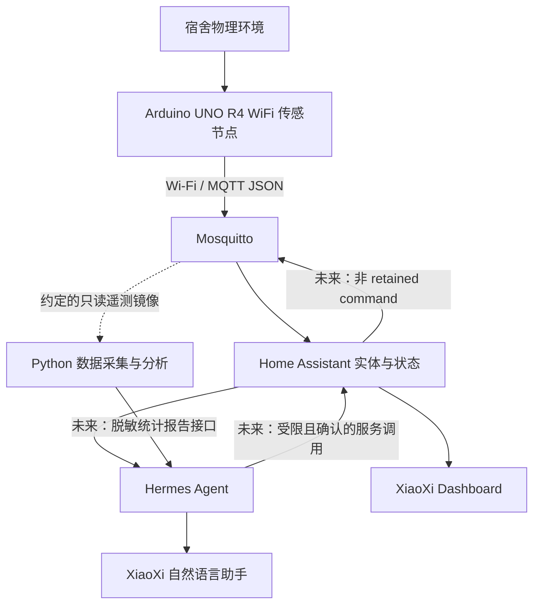

# 系统架构与模块边界

XiaoXi DormSense / 交小西宿舍智能体，是独立学生课程项目。架构服务于可完成、可验收的六人课程作业，不引入微服务集群、消息队列套娃或逐样本 LLM 推理。

主链严格为 **Arduino → MQTT → Home Assistant → Hermes Agent**。分析层不重复控制设备，使用订阅 Broker 的只读 telemetry/status/event 接口保留原始消息与服务器接收时间；这是明确约定的数据出口，不是绕过 HA 控制。HA 负责当前实体状态，分析负责历史统计，两者通过 node_id/entity_id 映射对齐。

## 模块契约

| 模块 | 所有者 | 输入 → 输出 | 不负责 |
| --- | --- | --- | --- |
| firmware | B，A评审 | 实物驱动 → v1遥测/状态 | LLM 推理、云凭据 |
| MQTT/集成 | A | 协议、节点ID、网络实验 | 单方面改其他模块接口 |
| HA/部署 | C，F场景 | MQTT → 实体/Dashboard | 隐式执行任意 Agent 指令 |
| analytics | D | 只读 MQTT → 清洗/统计/图表/日报 | 向节点发送控制 |
| hermes | E | 用户意图、HA状态、未来统计 → 解释 | 高频采样、确定性告警替代 |
| 测试/交互 | F | 接口与场景 → 验收/演示 | 虚构测试结果 |

## 已交付与 Planned

初始化交付的是协议、模拟器、配置样例、文档和离线测试，不是完整系统。固件、真实传感器链路、常驻采集器、数据库、异常检测、统计服务、Agent 自定义工具、安全控制均 Planned。

### 数据路线（Planned）

1. 首期使用 JSONL 原始追加存储和 Pandas 离线处理，先不部署 InfluxDB/Grafana。
2. 采集包络 `{received_at, topic, payload}`，保留 simulated、boot_id、sequence 和原始 null；UTC 存储，展示时转换本地时区。
3. 清洗先去重、隔离异常格式、按启动段排序，缺失与插值分别标记。不能把模拟与实测混为一个实验数据集。
4. 日报先生成脱敏 Markdown/JSON（窗口、有效样本数、缺失率、规则版本、统计与确定性事件）；后续由 D/E 商定版本化查询接口，并由 E 实现适配。**当前不存在 HTTP 报告 API 或可调用自定义 Skill。**
5. 阈值、滑动窗口等确定性逻辑检测异常；Agent 仅解释结果，不把全部遥测上传给模型。日报汇总也不应包含个人作息推断。

### 控制与失效

首期只读，无开关实体。后续仅低压 LED 操作，经 HA → MQTT → 节点，明确目标、白名单与用户确认。不能只靠提示词保证安全，Hermes 上游的真实权限粒度见[核查说明](../hermes/README.md)。断网不阻塞采样；HA 区分 unknown/unavailable 与正常值；没有数据时 Agent 说“不知道/数据不可用”，不能编造。

### 工程选型

- Arduino IDE 2.x + 官方 UNO R4 Boards 包为初期基线，降低课程组接入成本；确认板卡核心及传感器库版本后记录。PlatformIO 仅在 B 验证该板支持、工具链与烧录稳定后采用，不预生成不确定的 board ID。
- Python 3.11+，小模块与 unittest 即可；不先上大型 Web 框架。
- Compose 只部署基础设施，不打包 Hermes 上游，不提前容器化固件或 GPU 推理。
- 未来多宿舍/ESP32/时间序列数据库均在当前接口稳定后扩展，不预先做多租户。

关联：[MQTT](mqtt-protocol.md) · [硬件](hardware.md) · [路线图](roadmap.md) · [团队](team.md)。
